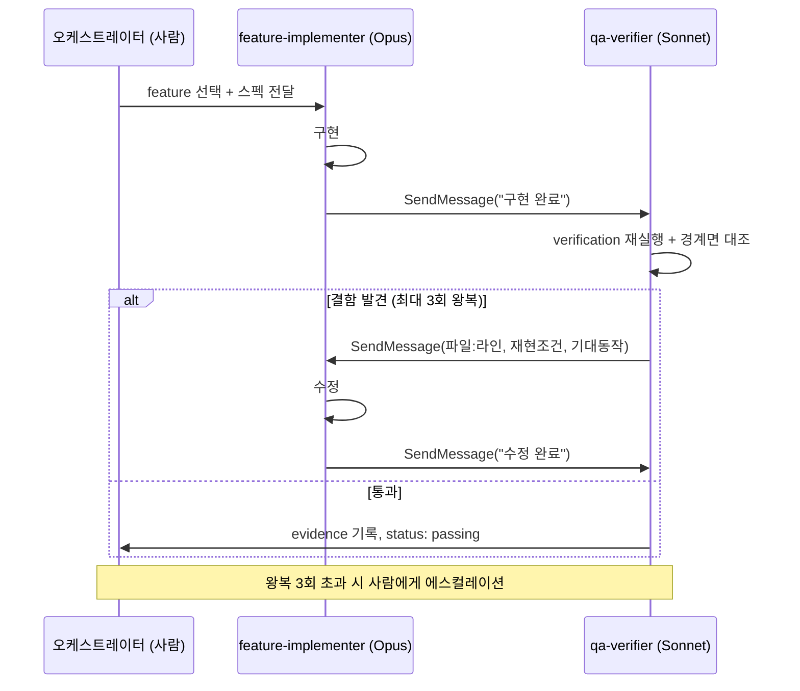

yjs와 React Flow로 실시간 협업 캔버스([canvas-v](https://github.com/dooohun/canvas-v))를 만들면서, Claude Code를 단순한 "코드 짜주는 도구"가 아니라 하나의 작은 개발팀처럼 운영해봤다. 오케스트레이터 역할의 나, 구현을 전담하는 서브에이전트, 검증을 전담하는 서브에이전트로 역할을 나누고, 이들 사이의 커뮤니케이션과 신뢰 구조를 규칙으로 설정하는 방식이었다. 이 글에는 그 구조를 세우면서 실제로 겪은 시행착오와 지금 시점의 정리를 담는다.

## 왜 이런 구조가 필요했나

AI에게 기능 구현을 맡기다 보면 흔히 겪는 문제가 있다. 코드는 그럴듯하게 나오는데, 정말 그 기능이 동작하는지는 아무도 확인하지 않은 채 "완료"로 표시되는 것이다. 특히 실시간 협업처럼 여러 클라이언트가 얽히는 도메인에서는 REST 응답 형태와 프론트 코드가 어긋나거나, WebSocket 메시지 스펙과 실제 송수신 로직이 미묘하게 다른 식의 버그가 테스트를 통과한 뒤에도 남아있는 경우가 많았다.

그래서 세운 원칙은 하나다. **AI의 자기 보고를 그대로 믿지 않는다.** 구현한 에이전트와 검증하는 에이전트를 분리하고, 검증 결과조차 다시 의심하는 구조를 만들었다.

## 1. 스펙 파일과 문서를 메뉴얼로 만든다.

기본적으로 AI를 활용해서 무엇인가를 만들기 위해 프롬프트를 작성하는데, 이때 처음 작성하게 되면 아무런 컨텍스트 없이 시작하게 된다. 즉 아무것도 모르는 상태이기 때문에 어디서부터 어떻게 시작해야하는지, 그리고 어떤 배경을 가지고 있는지 알지 못한다. 그래서 가장 먼저 한 일은 저장소 안에 "규칙" 역할을 하는 문서를 만들어 메뉴얼로 사용하도록 했다.

- **CLAUDE.md**: 기술 스택, 명령어, 그리고 절대 어겨선 안 되는 규칙을 명시했다. API 키는 서버 환경변수로만 다룬다, yjs 인코딩은 y-protocols로만 처리한다, 서버는 도메인 타입을 몰라야 한다, 타입은 `packages/shared-types`에 한 곳에서만 정의한다, 불필요한 주석은 금지한다 같은 규칙이다. 모든 서브에이전트 프롬프트가 이 문서를 반복해서 인용하게 했다.
- **feature_list.json**: 백로그이자 진행 상태 트래커다. 각 feature는 id, priority, status(`not_started`·`in_progress`·`blocked`·`passing`), user_visible_behavior, verification, evidence, notes 필드를 가진다. 여기서 핵심은 "완료"의 정의다. 테스트가 초록불이라고 완료가 아니라, verification 항목이 실제로 실행되어 evidence로 남아야만 완료로 인정한다(`passing_requires_evidence: true`).
- **docs/** 아래의 architecture.md, data-model.md, api-spec.md, ws-protocol.md, product-plan.md, acceptance-criteria.md가 설계 문서 역할을 한다. 일부 문서가 아직 스텁 상태라면, 해당 feature를 맡은 에이전트가 그 절을 구체화하는 것까지 자기 작업 범위에 포함시키도록 규칙으로 정했다. 문서가 부실하다는 이유로 검증을 건너뛰지 못하게 하기 위해서다.

```markdown
# CLAUDE.md (발췌)

## 절대 규칙

- API 키는 서버 환경변수로만 다룬다. 클라이언트 번들에 노출 금지.
- yjs 인코딩/디코딩은 반드시 `y-protocols`를 통해서만 수행한다.
- 서버는 도메인 타입을 몰라야 한다 — 서버 레이어에서 `packages/shared-types`
  외의 타입 정의를 금지한다.
- 공유 타입은 `packages/shared-types`에 단 한 곳에서만 정의한다.
- 불필요한 주석은 작성하지 않는다. 코드 자체가 설명이 되게 한다.

## "완료"의 정의

feature_list.json의 `passing_requires_evidence: true` 규칙에 따라,
테스트 통과가 아니라 verification 배열이 실제로 실행되고
evidence로 기록되어야만 완료로 인정한다.
```

```json
{
  "id": "realtime-cursor-sync",
  "priority": "P1",
  "status": "passing",
  "user_visible_behavior": "다른 사용자의 커서 위치가 100ms 이내로 캔버스에 반영된다",
  "verification": [
    "두 브라우저 탭에서 각각 커서를 이동시키고 상대 탭에 반영되는지 확인",
    "네트워크 지연 300ms 시뮬레이션 후에도 커서 위치가 수렴하는지 확인"
  ],
  "evidence": [
    "2026-08-10 QA 재현: 탭A→탭B 반영 지연 평균 62ms (스크린 레코딩 첨부)",
    "네트워크 스로틀링 테스트 통과 로그: logs/qa/realtime-cursor-sync-2026-08-10.log"
  ],
  "notes": "mock 기반 전이만 검증됨. 실 서버 다중 리전 지연 환경은 미검증."
}
```

## 2. 오케스트레이터-서브에이전트 팀 패턴 (feature-loop 스킬)

`.claude/skills/feature-loop/SKILL.md`에 정의한 자동화 루프의 구조는 이렇다.

**역할 분리**

- `feature-implementer` (Opus): 구현 전담
- `qa-verifier` (Sonnet, 비용 절감을 위해 다운그레이드): 검증 전담

둘 다 `.claude/agents/*.md`에 시스템 프롬프트로 정의된 커스텀 에이전트다.

**생산자-검증자 루프**

1. implementer가 구현한다.
2. `SendMessage`로 QA 에이전트에게 완료를 통지한다.
3. QA는 verification 항목을 "코드가 존재하는가"가 아니라 "실제 사용자 행동으로 이어지는가"의 기준으로 검증한다.
4. 결함이 있으면 파일:라인, 재현 조건, 기대 동작을 담아 다시 implementer에게 메시지를 보낸다.
5. 최대 3회 왕복까지는 두 에이전트가 자체적으로 조율하고, 그 이상 반복되면 오케스트레이터(나)에게 에스컬레이션한다.

**경계면 우선 검증**
QA 에이전트 프롬프트에는 "양쪽을 동시에 읽어야 하는 지점" 표를 박아두었다. REST 응답 shape ↔ 프론트 소비 코드, WS 메시지 스펙 ↔ 실제 송수신 코드, 공유 타입 ↔ 실사용처를 반드시 대조하게 강제한 것이다. "테스트가 초록불이어도 인터페이스 경계에서 버그가 난다"는, 이 프로젝트에서 반복적으로 겪은 실패 패턴에서 나온 규칙이다.

**호출당 feature 1개 원칙**
한 번 호출에 feature 하나만 처리하고 종료한다. Ralph Loop 같은 외부 반복 실행기가 매번 스킬을 재트리거하는 구조를 전제로, 실패했을 때 git 커밋 단위로 어디까지가 정상이었는지 추적할 수 있게 하기 위해서다.

이 흐름을 그림으로 정리하면 이렇다.



## 3. 신뢰하지 않고 재검증하는 문화

QA 에이전트가 같은 feature를 다시 검증할 때는 이전 QA 결과를 신뢰하지 않고 코드를 다시 읽고 다시 실행해본다. 실제로 ai-image-generation 기능의 2차 재검증 과정에서, 1차 검증 때는 지나쳤던 `docs/acceptance-criteria.md`의 문구 오류를 새로 잡아낸 적이 있다.

또 하나의 규칙은, 같은 결함이 두 번 지적되면 표면적인 수정이 아니라 근본 원인을 찾으라는 것이다. 드래그 중 화면이 깜빡이는 버그와 한글 입력(IME) 조합이 끊기는 버그가 사실 같은 원인에서 비롯됐다는 걸 나중에 재조사로 알게 된 사례가 이 규칙의 근거로 남아있다.

## 4. 하네스 자체를 관측 가능하게 만들기

`.claude/observability/feature-loop.jsonl`에는 `feature_selected`, `roundtrip`, `escalation`, `final_status` 네 가지 이벤트만 한정해서 append-only로 기록한다. 이건 "결과물이 무엇인가"를 남기는 feature_list.json의 evidence/notes와는 목적이 다르다. 하나는 산출물 증빙이고, 하나는 이 자동화 루프 자체가 얼마나 잘 굴러가고 있는지 관측하기 위한 것이다.

```jsonl
{"event":"feature_selected","feature":"realtime-cursor-sync","ts":"2026-08-10T02:11:04Z"}
{"event":"roundtrip","feature":"realtime-cursor-sync","count":1,"ts":"2026-08-10T02:14:20Z"}
{"event":"roundtrip","feature":"realtime-cursor-sync","count":2,"ts":"2026-08-10T02:22:47Z"}
{"event":"final_status","feature":"realtime-cursor-sync","status":"passing","ts":"2026-08-10T02:25:03Z"}
```

이런 식으로 이벤트만 쌓아두면, feature별 평균 왕복 횟수나 에스컬레이션 빈도 같은 걸 나중에 쿼리로 뽑아볼 수 있다.

## 5. 사람이 병합 지점을 통제하는 브랜치 전략

처음에는 main 브랜치에 직접 커밋하는 방식으로 시작했지만, 이후 전략을 바꿨다. 모든 자동 구현은 `feature-loop/remaining-features`라는 공유 브랜치에서만 일어나고, 9개 feature가 전부 passing 상태가 된 뒤에야 사람이 리뷰하고 병합한다.

`.github/PULL_REQUEST_TEMPLATE.md`에는 "리뷰어가 특히 봐야 할 곳" 섹션을 강제해뒀다. implementer와 QA가 evidence·notes에 남긴 "미확인", "임시방편" 같은 표시를 여기로 옮겨 적게 해서, 자동 생성된 코드를 사람이 리뷰할 때 가장 먼저 봐야 할 곳을 놓치지 않게 하는 장치다.

```markdown
## 리뷰어가 특히 봐야 할 곳

<!-- implementer/QA의 evidence·notes 중 "미확인", "임시방편" 표시를 여기로 옮겨 적을 것 -->

- [ ] realtime-cursor-sync: 다중 리전 지연 환경 미검증 (mock 기반만 검증됨)
- [ ] websocket-reconnect: handleDisconnect() 회귀 테스트, 수정 되돌려서 실패 확인함
```

## 6. 세션 간 메모리: 두 종류의 기록을 분리

- **claude-progress.md**: 세션별 상태 스냅샷. 무엇을 했는지를 시간순으로 기록한다.
- **session-handoff.md**: What Remains / Decisions Made / Blockers / Next Steps 구조로 정리한다. 특히 Decisions Made에는 결과가 아니라 "왜 그렇게 결정했는지"만 남긴다. 예를 들어 fan-in 정렬 기준을 엣지 생성 순서가 아니라 캔버스 좌표로 잡은 이유(모든 피어가 결정론적으로 같은 결과를 봐야 하기 때문) 같은 것이다.

이렇게 분리해두면 다음 세션이나 다음 에이전트가 "무엇이 있었는지"와 "왜 그렇게 했는지"를 각각 빠르게 훑을 수 있다.

## 7. 실제로 드러난 실패와 학습

- **재렌더 성능 버그**: 드래그 중 화면이 깜빡였다. 원인은 노드 트리가 매번 재생성되는 것이었고, `useNodesState`와 렌더링 중 상태 조정 패턴으로 근본 원인을 수정했다.
- **IME 조합 버그**: 한글 입력이 2~3글자만 들어가고 끊기는 증상이었다. 처음에는 증상만 가리는 방식으로 넘어갔지만, 나중에 재조사하면서 위 재렌더 버그와 같은 근본 원인임을 발견했고, 문제가 된 `useEffect` 자체를 제거하는 방향으로 해결했다.
- **재연결 무한 재귀**: WebSocket의 `onerror`가 `close`를 다시 호출하면서 재귀로 프로세스가 죽는 문제였다. QA 에이전트가 라이브 kill/재기동 시나리오를 테스트하다 발견했고, `handleDisconnect()`로 교체한 뒤 "수정을 되돌리면 실제로 실패하는" 회귀 테스트까지 추가했다. 이 회귀 테스트도 QA가 직접 수정을 되돌려서 실패를 확인하는 방식으로 검증했다.
- **검증 한계를 숨기지 않기**: 실 API 키가 없어서 검증하지 못한 부분은 항상 명시했다. "mock 기반 전이·에러 처리만 자동 검증됨, 실 키를 쓰는 종단 성공 경로는 미검증"이라고 evidence/notes에 정직하게 남기고, 임의로 passing 처리하지 않았다.

## 8. 이 구조는 "루프 엔지니어링"과 어떻게 맞닿아 있나

이 구조를 세우고 나서 돌아보니, 2026년 상반기부터 업계에서 회자되던 "루프 엔지니어링(loop engineering)"이라는 흐름과 상당 부분 겹친다는 걸 알게 됐다. 몇 가지 구체적인 지점을 짚어본다.

**Ralph Loop와의 직접적 연결**

feature-loop 스킬에서 "호출당 feature 1개만 처리하고 종료"하는 원칙은 Geoffrey Huntley가 이름 붙인 Ralph Loop 기법을 그대로 가져온 것이다. Ralph Loop는 심슨 가족의 랄프 위검(Ralph Wiggum) 캐릭터에서 이름을 땄는데, "예측 불가능한 세상에서 결정론적으로 단순하다"는 취지다. 방식은 단순하다. 하나의 목표 프롬프트를 평범한 while 루프 안에서 반복 실행하되, 매 반복마다 완전히 새로운 에이전트 인스턴스를 깨끗한 컨텍스트로 시작한다. 진행 상황은 모델의 대화 기억이 아니라 파일 시스템과 git 히스토리에 쌓인다.

이게 중요한 이유는 컨텍스트 부패(context rot) 때문이다. 세션이 길어질수록 컨텍스트 창이 낡은 추론과 죽은 경로, 오래된 파일 내용으로 채워지면서 에이전트 성능이 떨어진다. canvas-v에서 "1 호출 = 1 feature, 실패 시 git 커밋 단위로 어디까지 정상인지 추적"하는 규칙은 이 컨텍스트 부패를 피하기 위한 설계이고, feature_list.json과 session-handoff.md처럼 상태를 파일에 외재화해두는 것도 같은 이유다 — 에이전트가 아니라 저장소 자체가 메모리 역할을 하게 만드는 것.

Ralph Loop 원형을 개념적으로 옮기면 이런 모양이다.

```bash
# Ralph Loop 패턴 (개념 요약, 실제 실행 스크립트 아님)
while feature=$(next_pending_feature feature_list.json); do
  claude --agent feature-implementer --context "$feature" --fresh-session
  claude --agent qa-verifier --context "$feature" --fresh-session
  git commit -am "feat: $feature (roundtrip $ROUNDTRIP)"
  [ "$ROUNDTRIP" -gt 3 ] && escalate_to_human "$feature" && break
done
```

canvas-v의 feature-loop 스킬이 하는 일이 본질적으로 이것이다. 다만 한 번의 `claude` 호출 안에서 implementer와 QA가 별도 에이전트로 이미 나뉘어 있다는 점이 다르다.

**"검증자가 병목"이라는 관점의 일치**

루프 엔지니어링 담론에서 반복적으로 나오는 지적이, 루프에서 진짜 병목은 모델이 아니라 검증자(verifier)라는 것이다. 아무것도 되받아치지 않는 루프는 결국 에이전트가 스스로에게 동의하는 것과 다르지 않다. canvas-v의 QA 에이전트를 "존재 확인"이 아니라 "실제 사용자 행동으로 이어지는가"로 검증하게 만들고, evidence 없이는 절대 passing 처리하지 않게 한 규칙이 정확히 이 문제의식에서 나온 것이다. 재검증 시 이전 QA 결과조차 신뢰하지 않고 다시 읽고 다시 실행하게 한 것도 마찬가지다.

**정확히는 "멀티 에이전트 오케스트레이션" 레이어**

다만 canvas-v 구조를 순수 Ralph Loop라고 부르기는 어렵다. Ralph Loop 원형은 에이전트 하나가 사람 없이 혼자 도는 방식인데, canvas-v는 implementer와 QA 두 에이전트가 SendMessage로 통신하고, 3회 왕복을 넘기면 사람(오케스트레이터)에게 에스컬레이션하는 구조다. 이건 단일 에이전트 루프보다는, 여러 에이전트 루프를 관리하는 슈퍼바이저 루프 — 그리고 그 이전에 Anthropic이 「Building Effective Agents」에서 제시했던 오케스트레이터-워커, 평가자-최적화자 패턴에 더 가깝다. 계보로 보면 ReAct → AutoGPT → Ralph Loop → 멀티 에이전트 오케스트레이션으로 이어지는 흐름의 뒤쪽에 canvas-v 구조가 위치하는 셈이다.

**보완하면 좋을 지점**

루프 엔지니어링 쪽에서 최근 강조되는 안전장치 중 canvas-v에 명시적으로 없는 게 하나 있다. 바로 비용 예산 캡과 무진행(no-progress) 감지다. 3회 왕복 후 에스컬레이션이 무한 루프를 막는 역할을 하긴 하지만, "이 feature에 쓸 수 있는 토큰/비용 상한"처럼 명시적인 예산 통제는 아직 두지 않았다. 실제 업계 사례에서는 팀 단위로 도구당 월 비용 상한을 두는 경우도 있는데, feature 단위로도 비슷한 캡을 두는 걸 다음 개선 지점으로 고려하고 있다.

## 정리

이 구조를 한 문장으로 요약하면, **AI 에이전트를 신뢰하되 검증은 별도로, 그리고 그 검증조차 다시 의심한다**는 것이다. 구현과 검증의 역할을 분리하고, "완료"의 기준을 evidence로 못박고, 실패했던 지점을 문서로 남겨서 같은 실수를 반복하지 않게 하는 것—결국 사람 개발팀에서 코드 리뷰와 QA 프로세스를 두는 이유와 크게 다르지 않았다. 다만 그 팀원이 AI 에이전트라는 점 때문에, 규칙을 코드가 아니라 프롬프트와 문서로 명문화해야 했다는 차이가 있다.

프로젝트는 아직 진행 중이고, 이 구조도 계속 다듬어가고 있다. 다음 글에서는 feature-loop 스킬의 실제 설정 파일과 서브에이전트 프롬프트 예시를 더 구체적으로 다뤄볼 생각이다.
